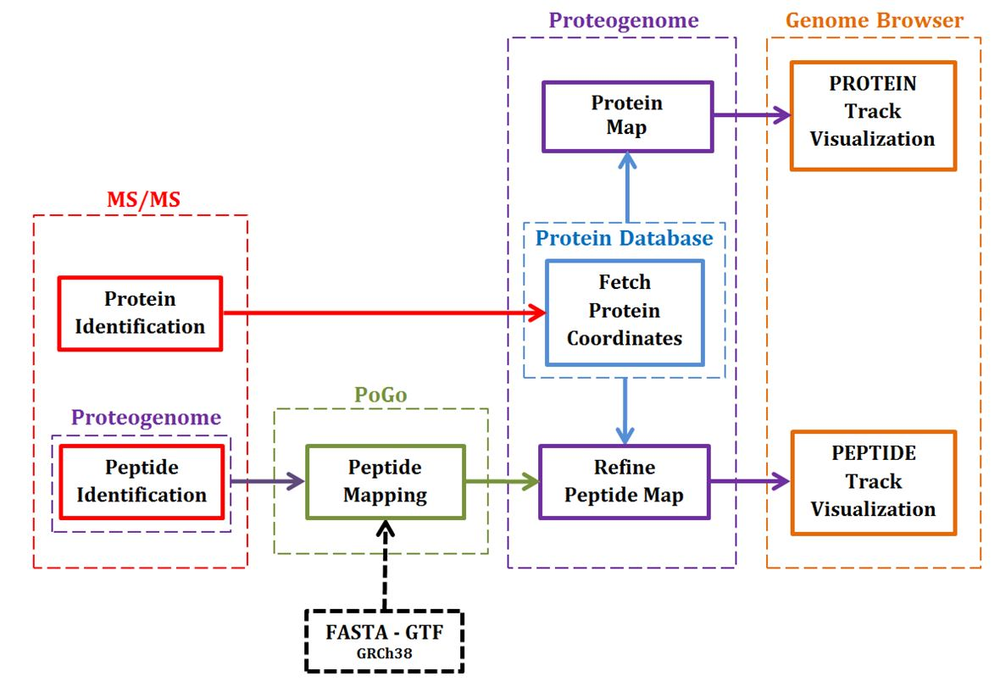

# MSc Bioinformatics with Systems Biology
This repository contains the Python module Proteogenome and a folder with proteomics data. 

#### Folder TestFiles:
- **proteome_test.csv**      :  This file contains a table in a PLGS format with peptides data from MS/MS analysis. 
- **PoGo_peptides.bed**      :  the peptide map performed by PoGo
- **PoGo_peptides_PTM.bed**  :  the map of PTMs performed by PoGo


These data are provided in order to test Proteogenome.


## Proteogenome Workflow


❮img src="images/ProteogenomeWorkflow.JPG" ❯
The schema of our visualization workflow could be divided in four main steps. Red area: input data- Green area: mapping the peptides with PoGo - Purple area: prepare the tracks (using the genomic coordinates) - Orange area: visualize the tracks. 
In the dashed boxes are indicated the sources that provide information or the tools that manipulate the data along the process. In the solid boxes are represented the main operations necessary to accomplish the mapping and visualization task. Some tools collect and process external data, like PoGo and Proteogenome. For instance, PoGo needs proteins sequence and annotations in FASTA and GTF format. However, this data must be provided by the user, fore instance, from the Ensembl database (dashed black box for GRCh38). Instead, Proteogenome access to the proteins database (dashed azure box) collecting the genomic coordinates only for the proteins identified in the MS/MS analysis (upper solid red box). For this reason, although the “Protein Database” is an external data source, it is enclosed in the Proteogenome box because accessed by the tool itself. Moreover, Proteogenome is involved in data preparation for PoGo. The purple dashed box that surround the ‘Peptide Identification’ highlights the manipulation of proteomics data table in order to obtain a proper txt input file for the PoGo sotware.
The two purple arrows from Proteogenome box represent the generation of the two tracks containing proteins and peptides maps. Therefore, it is possible to identify two main pathways in this wokflow. The upper way for the proteins map and the lower for the peptides map. However, the peptides map is dependent on the protein map. Indeed, it is necessary to fetch the protein genomic coordinates in order to refine the PoGo track.


## Run the simulation
In order to run the simulation:
	- create a working folder.
	- copy in the folder the Proteogenome.py 
	- copy in the folder the content of TestFiles folder. 

At the end of the simulation,  in the working folder will be present this group of files. The OUTPUT FILES represent the three maps for proteins, peptides and PTMs respectively.  


```
~  
└── Working folder
         ---------------------------------INPUT FILES
        ├── Proteogenome.py
        ├── proteome_test.csv
        ├── PoGo_peptides.bed
        ├── PoGo_peptides_PTM.bed
         ---------------------------------DATA MANIPULATION FILES
        ├── PoGo_input_file.txt
        ├── protein_M1.txt
        ├── p_notfound.txt
        ├── p_recovered.txt
         ---------------------------------OUTPUT FILES
        ├── protein_heat_map.bed
        ├── peptides_filtered.bed
        └── PTM_filtered.bed
```

## 1. Prepare input data
**1.1 Upload proteomics data**

    # Define the set of columns names in the csv input file, that match the required data for Proteogenome.

	csv_cols = ['protein.Accession','peptide.seq','peptide.modification', 'peptide.MatchedProducts','peptide.MatchedProductsSumInten']

    proteome = pg.load_proteomic_data('proteome_test.csv', target_cols=csv_cols,reshape=True)

**1.2	Apply the PTMs to the peptide sequences**

    remove_ PTMs = ['None','Carbamidomethyl']

    proteome_PTM = pg.PoGo_input_df(proteome, PTMs_to_remove = remove_ PTMs)

**1.3	Generate the PoGo input file**

    pg.PoGo_input_file('PoGo_input_file.txt',proteome_PTM,'Experiment_test')


## 2. Generate protein heat map
**METHOD 1 - 1. Create protein reference tables for level of expression and peptides**

    # Protein expression levels dictionary
    prot_expre = pg.get_proteins_expr(proteomePTM)

    # Protein-Peptides dictionary
    prot_peptides = pg.get_proteins(proteomePTM)

**METHOD 1 - 2. Fetching protein genomic coordinates**

    # Set the output filenames for the raw protein records and the mismatched codes.
    p_1_filename  = 'protein_M1.txt'
    p_M_filename  = 'p_notfound.txt'
**METHOD 1 - 3. Download the protein records**
     
    prot_raw_records,mismatch_protein = pg.download_proteins_set(prot_expre,prot_peptides, 
                                                                 db_type='UPKB', print_out=True,
                                                                 proteins_output       = p_1_filename, 
                                                                 error_proteins_output = p_M_filename)

Now it is possible to try to recover the protein codes that did not found a match in the previous step. There are two METHODs that could be applied alternatively. The task include a conversion of UniProt codes in Ensembl codes. Then the UniProtKB database will be quired again with the Ensembl codes. The funtion used for this conversion is 'UP2Ens_code_conv'. Setting the parameter db_type='IDmap' will be used the API service for Retrieve / ID map for the conversion. Instead, setting the same parameter to 'UniParc', will be used the 'UniParc' API.

**METHODS 2/3 - 1. Create protein reference tables for level of expression and peptides**
     
    M_expr,M_pept = pg.generate_prot_expr_pept_dict(mismatch_protein)


<p align="center"><strong>METHOD 2 - <em>Convert the UniProt codes in Ensembl codes - Retrieve / ID map service</em></strong></p>

    M_expr,M_pept = pg.UP2Ens_code_conv(M_expr, M_pept, db_type='IDmap', print_out=True)

<p align="center"><strong>METHOD 3 - <em>Convert the UniProt codes in Ensembl codes - UniParc service</em></strong></p>

	M_expr,M_pept = pg.UP2Ens_code_conv(M_expr, M_pept, db_type='UniParc', print_out=True)


**METHODS 2/3 - 2. Download the protein records.**

	p_recovered_filename = 'p_recovered.txt'

	rec_raw_prot = pg.download_proteins_set(M_expr, M_pept, db_type='Ens', print_out=True, proteins_output=p_recovered_filename)

**2.1 	Create the protein databases for the methods that have been used**

	# Generate the protein database for the protein records fetched trough the Method 1
	prot_tab_M1, exon_tab_M1 = pg.prot_genome_loc(prot_raw_records, ens=False)

	# Generate the protein database for the protein records fetched trough the Method 2 or Method 3
	M_prot_tab, M_exon_tab = pg.prot_genome_loc(rec_raw_prot, ens=True)  

**2.2	Merge the two protein databases** 

	 prot_tab, exon_tab = pg.merge_prot_exon_tabs(prot_tab_M1, exon_tab_M1, M_prot_tab , M_exon_tab)

**2.3	Generate the protein heat map**

    protein_hm_filename  = 'protein_heat_map.bed'

	pg.proteome_Hmap_BED(prot_tab,exon_tab, protein_hm_filename, log_transf='2', rev_col_gradient=False)

             
## 3.	Generate peptide map with PoGo and Proteogenome
**3.1	Mapping the peptides and PTMs with PoGo**

In this step use the two PoGo file provided **PoGo_peptides.bed** and **PoGo_peptides_PTM.bed** or refer to [PoGo documentation](https://github.com/cschlaffner/PoGo)

**3.2 	Upload the peptide and PTM maps**

	PoGo_BED_filename = 'PoGo_peptides.bed'

	PoGo_bed = pg.up_PoGo_bed(PoGo_BED_filename)

	PoGoPTM_BED_filename = 'PoGo_peptides_PTM.bed'

	PoGoPTM_bed = pg.up_PoGo_bed(PoGoPTM_BED_filename)


**3.3	Filter PoGo BED files with Proteogenome**

	peptides_filtered_filename = 'peptides_filtered.bed'

	prot, pepfiltered = pg.filter_PoGo_BED(PoGo_bed, prot_tab, exon_tab, peptides_filtered_filename, progbar=True)

	PTM_filtered_filename = 'PTM_filtered.bed'

	protPTM, PTMfiltered = pg.filter_PoGo_BED(PoGoPTM_bed, prot_tab, exon_tab, PTM_filtered_filename, progbar=True)


